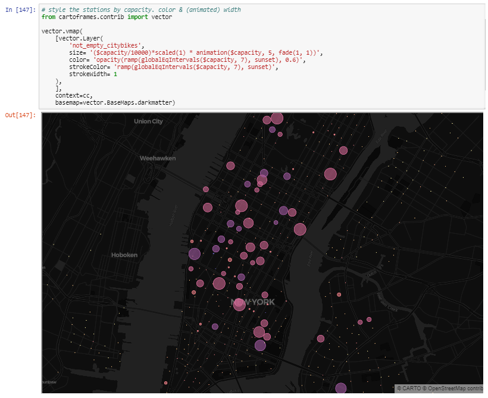

# EOI (Escuela de Organización Industrial) CARTOframes seminar

This repo contains the Jupyter notebook used in the seminar in order to show how the Data Scientists can build vector maps using [CARTOframes](https://cartoframes.readthedocs.io/en/latest/) and the [CARTO VL expressions](https://carto.com/developers/carto-vl/v0.8.0/reference/#cartoexpressions)

That's an extended notebook example from the [official examples](https://github.com/CartoDB/cartoframes/tree/master/examples) including the 'vector maps' module to play with CARTO VL expressions

Content description
====================

- Target => Process and show up real time data from [Citibike](https://www.citibikenyc.com/system-data)
- Read and write data into your CARTO account
- Visualize, query and style CARTO tables

Why CARTOframes?
====================

CARTOframes is a Python package for integrating CARTO maps, analysis, and data services into data science workflows

Python data analysis workflows often rely on the de facto standards pandas and Jupyter notebooks

Install Instructions
====================

To install `cartoframes` on your machine, do the following to install the
latest version:

.. code:: bash

    $ pip install cartoframes

More info
=========

- Complete documentation: http://cartoframes.readthedocs.io/en/latest/
- Source code: https://github.com/CartoDB/cartoframes
- bug tracker / feature requests: https://github.com/CartoDB/cartoframes/issues
